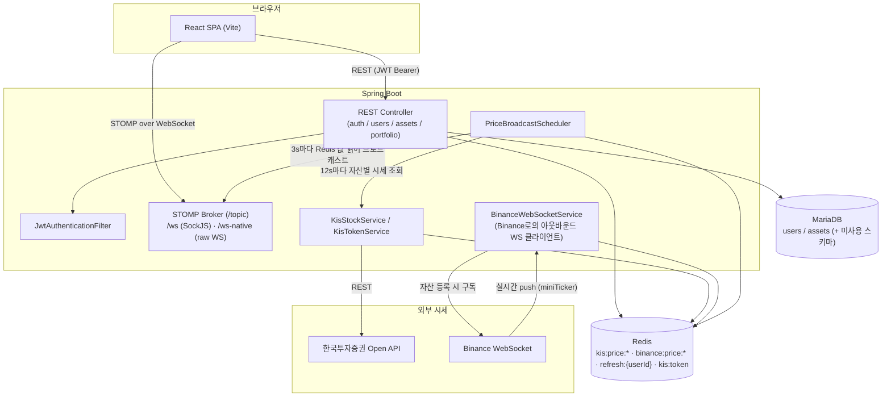
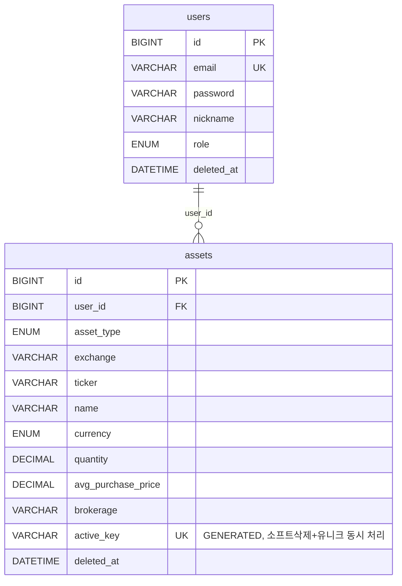

# StockFolio

실시간 주식·코인 포트폴리오 트래커

국내주식 / 해외주식 / 코인 자산을 등록하면 한국투자증권 Open API, Binance WebSocket 시세를 서버가 주기적으로 수집해 Redis에 캐싱하고, STOMP WebSocket으로 클라이언트에 실시간 전송합니다. 프론트엔드는 이를 받아 평가금액·수익률을 즉시 갱신하고 파이/바 차트로 시각화합니다.

- **GitHub**: https://github.com/emssme/stockFolio
- **배포 링크**: _(배포 URL 추가 예정)_
- **팀 구성**: 1인 개발

---

## 목차

1. [기술 스택](#기술-스택)
2. [아키텍처](#아키텍처)
3. [주요 기능 및 기술적 의사결정](#주요-기능-및-기술적-의사결정)
4. [트러블슈팅](#트러블슈팅)
5. [실행 방법](#실행-방법)
6. [API 명세](#api-명세)
7. [ERD / DB 설계](#erd--db-설계)
8. [테스트](#테스트)
9. [데모](#데모)
10. [회고 / 향후 개선](#회고--향후-개선)
11. [기획 문서](#기획-문서)
12. [Git 커밋 규칙](#git-커밋-규칙)

---

## 기술 스택

| 구분 | 기술 |
|------|------|
| Backend | Java 17, Spring Boot 3.5, Spring Security, Spring Data JPA, Spring WebSocket(STOMP) |
| Frontend | React 19, Vite, Ant Design 6, Recharts, @stomp/stompjs, axios |
| DB | MariaDB (Flyway 마이그레이션) |
| 캐시 / 세션 | Redis (시세 캐시, Refresh Token, KIS Access Token 캐시) |
| 인증 | JWT (Access/Refresh, HS256) |
| 외부 API | 한국투자증권(KIS) Open API, Binance WebSocket |
| 배포 | AWS EC2 |

---

## 아키텍처



### 요청 흐름 요약

- **REST**: `JwtAuthenticationFilter`가 매 요청에서 `Authorization: Bearer {accessToken}`을 검증해 `SecurityContext`에 `userId`를 심고, 컨트롤러는 이를 꺼내 인가 없이도 인증만으로 자기 자산에 접근합니다. `/api/auth/**`, `/ws/**`, `/ws-native/**`만 인증 없이 허용됩니다.
- **시세 수집**: `PriceBroadcastScheduler`가 12초마다 보유 자산을 순회하며 국내/해외 주식은 KIS REST API를, 코인은 이미 연결된 Binance WebSocket 세션을 통해 시세를 Redis에 채워 넣습니다. 3초마다 별도 스케줄로 Redis의 `kis:price:*` / `binance:price:*` 키를 읽어 `/topic/price/{ticker}`로 STOMP 브로드캐스트합니다.
- **실시간 반영**: 코인은 자산을 등록하는 시점에 `BinanceWebSocketService.subscribe()`가 호출되어 해당 심볼의 Binance WebSocket 연결이 그때 처음 열립니다(사전 전체 구독이 아니라 지연 구독 방식).

---

## 주요 기능 및 기술적 의사결정

- **이메일/비밀번호 회원가입·로그인 (JWT Access/Refresh)**
  Refresh Token은 DB가 아니라 **Redis**(`refresh:{userId}`, TTL 7일)에 저장합니다. 재발급 시 저장된 토큰과 요청 토큰을 비교해 일치하지 않으면 `REFRESH_TOKEN_REUSED`로 거부하고, 재발급마다 새 Refresh Token으로 교체(로테이션)합니다. → DB 테이블 대신 TTL이 있는 Redis를 쓴 이유는 만료 시각 관리를 Redis TTL에 위임하고, 별도 만료 배치 job을 두지 않기 위해서입니다.

- **국내/해외 주식·코인 자산 등록 및 관리 (CRUD)**
  자산 유형(`STOCK_KR`/`STOCK_US`/`CRYPTO`)에 따라 통화·거래소·티커 정규화 규칙이 다릅니다. 코인은 등록 시 티커를 `{SYMBOL}USDT`로 정규화하고 그 즉시 Binance WebSocket을 구독합니다. 해외주식은 거래소 코드(`exchange`, 예: `NAS`, `NYS`)가 없으면 `INVALID_INPUT`으로 거부합니다.

- **실시간 시세 반영 (STOMP WebSocket)**
  최초 설계는 SockJS 기반 `/ws` 단일 엔드포인트였으나, 브라우저 콘솔 경고와 최신 `@stomp/stompjs` 클라이언트와의 호환성 문제로 **raw WebSocket 엔드포인트(`/ws-native`)를 추가**하고 프론트엔드는 이쪽으로 직접 연결하도록 변경했습니다([트러블슈팅](#트러블슈팅) 참고). `/ws`(SockJS)는 구버전 클라이언트/프록시 호환을 위해 남겨두었습니다.

- **Redis 캐싱으로 외부 API 호출 최소화**
  KIS 시세(가격+등락률)는 한 번의 API 호출로 함께 조회해 `kis:price:*`/`kis:change:*` 두 키에 동시 캐싱합니다(TTL 10초). KIS Access Token 역시 `kis:token` 키로 캐싱해(TTL 23시간) 요청마다 재발급받지 않습니다.

- **포트폴리오 집계 (`GET /api/portfolio`)**
  자산별 평가금액·수익금·수익률을 서버에서 계산해 목록과 함께 총합을 한 번에 내려줍니다. 별도의 "포트폴리오 요약 API"를 분리하지 않고 단일 응답에 합산 필드를 포함시켜 프론트엔드 요청 수를 줄였습니다.

- **소프트 삭제(soft delete)**
  `users`, `assets` 모두 물리 삭제 대신 `deleted_at`을 채우는 방식입니다. 모든 조회/수정/삭제 로직이 `deleted_at IS NULL` 조건을 사용합니다.

---

## 트러블슈팅

### 1. KIS API 초당 요청 제한 초과

- **문제**: 보유 자산이 늘어나면서 스케줄러가 KIS API를 짧은 시간에 몰아서 호출해 `EGW00201`(초당 거래건수 초과) 오류가 발생.
- **원인**: ① 자산 1건당 "현재가 조회"와 "등락률 조회"를 **별도 API 호출 2번**으로 처리하고 있었고, ② 갱신 주기(8초)에 비해 순회 중인 호출 사이에 아무 지연이 없어 자산 수가 늘수록 순간 호출 수가 선형으로 증가.
- **해결**:
  - KIS 응답이 현재가(`stck_prpr`/`last`)와 등락률(`prdy_ctrt`/`rate`)을 한 번에 포함한다는 점을 이용해 `fetchAndCacheDomestic`/`fetchAndCacheOverseas`로 **호출을 1회로 통합**, 캐시 2개(`kis:price:*`, `kis:change:*`)를 동시에 채움 → 자산당 호출 수 절반으로 감소.
  - 자산 순회 루프 내부에 `Thread.sleep(300)` 추가로 호출 사이 간격 확보, 갱신 주기도 8초 → **12초**로 완화.
- **결과**: 자산 10종목 이상 등록 시에도 초당 제한 오류 없이 안정적으로 시세 갱신.

### 2. WebSocket 콘솔 경고 및 SockJS 제거

- **문제**: 프론트엔드에서 `SockJS` + `Stomp.over(socket)` 조합 사용 시 최신 `@stomp/stompjs`(v7)에서 구버전 API 경고가 발생하고, 연결 안정성도 떨어짐.
- **원인**: `Stomp.over()`는 `@stomp/stompjs` v7에서 사실상 레거시 API이며, SockJS 폴백 계층이 불필요한 오버헤드를 추가.
- **해결**: `@stomp/stompjs`의 `Client`로 직접 raw WebSocket(`ws://.../ws-native`)에 연결하도록 변경. 이를 위해 백엔드 `WebSocketConfig`에 SockJS 없는 `/ws-native` STOMP 엔드포인트를 추가하고, `SecurityConfig`에서 `/ws-native/**`를 인증 예외로 허용.
- **부수 수정**: Ant Design v6에서 `Drawer`의 `width` prop 직접 사용이 deprecated 경고를 발생시켜 `styles.wrapper.width`로 이전.

### 3. 배포 환경에서 CORS 차단

- **문제**: 로컬에서는 정상 동작하던 API가 배포 환경 프론트엔드 도메인에서 호출 시 CORS로 차단됨.
- **원인**: `CorsConfig`에 허용 Origin이 `http://localhost:5173`로 하드코딩되어 있어 배포 도메인이 반영되지 않음.
- **해결**: 허용 Origin을 `ALLOWED_ORIGIN` 환경변수로 분리(미설정 시 로컬 기본값 유지)해 배포 환경별로 다른 도메인을 주입할 수 있도록 변경.

### 4. `application-local.yaml`의 시크릿 커밋

- **문제**: 로컬 전용 설정 파일에 KIS `app-key`/`app-secret`, JWT 서명 시크릿을 평문으로 작성했는데, `.gitignore` 등록 이전 커밋(`feat: 한국투자증권 Open API 연동`)에서 이미 추적되어 원격 히스토리에 남아있었음.
- **해결**: 파일을 `git rm --cached`로 추적 해제하고, `git filter-repo`로 전체 히스토리 및 모든 브랜치에서 해당 파일을 제거한 뒤 강제 푸시. KIS 앱 키와 JWT 시크릿은 모두 재발급/교체.
- **교훈**: `.gitignore`는 신규 추적만 막을 뿐 이미 추적 중인 파일에는 소급 적용되지 않는다는 점 — 시크릿이 포함될 수 있는 파일은 처음 커밋되기 전에 `.gitignore`부터 등록해야 함.

### 5. Refresh Token 재발급 시 동일 밀리초 충돌 가능성

- **문제**: `AuthControllerIntegrationTest`에서 로그인 직후 바로 재발급을 호출하는 테스트를 작성하던 중, 재발급받은 토큰이 이전 토큰과 완전히 동일하게 나오는 경우를 발견.
- **원인**: `JwtProvider.generateRefreshToken()`이 `subject`, `issuedAt`(밀리초 단위), `expiration`만으로 JWT 페이로드를 구성했는데, 두 호출이 같은 밀리초 안에 일어나면 페이로드가 완전히 같아져 HMAC 서명 결과(JWT 문자열) 자체가 동일해짐. 이 경우 "재발급마다 새 토큰으로 교체"라는 로테이션 전제가 깨짐.
- **해결**: `Jwts.builder().id(UUID.randomUUID().toString())`로 `jti` claim을 추가해 같은 밀리초에 발급되더라도 토큰이 항상 달라지도록 수정(`JwtProvider.java`).

---

## 실행 방법

Docker 구성은 아직 없어(향후 개선 항목) 로컬에 MariaDB/Redis를 직접 띄우는 방식만 지원합니다.

### 사전 준비

- Java 17, Node.js 18+, MariaDB, Redis
- 한국투자증권 Open API 앱키/시크릿 ([한국투자증권 Open API](https://apiportal.koreainvestment.com)에서 발급)

### Backend

```bash
cd stockfolio

# MariaDB에 스키마 생성 (DB명: stockfolio) 후, 아래 파일을 직접 작성
# src/main/resources/application-local.yaml (git에 커밋 금지 - 이미 .gitignore 처리됨)
```

```yaml
spring:
  datasource:
    url: jdbc:mariadb://localhost:3306/stockfolio?characterEncoding=UTF-8
    username: root
    password: {비밀번호}
  data:
    redis:
      host: localhost
      port: 6379

jwt:
  secret: {Base64 인코딩된 HMAC 시크릿}

kis:
  app-key: {발급받은 KIS app key}
  app-secret: {발급받은 KIS app secret}
  base-url: https://openapi.koreainvestment.com:9443
```

```bash
./gradlew bootRun
# 기본 프로필은 local (SPRING_PROFILES_ACTIVE 미설정 시)
# 서버 기동 시 Flyway가 db/migration 스크립트를 자동 적용
```

### Frontend

```bash
cd frontend
npm install

# .env 작성
echo "VITE_API_URL=http://localhost:8080" > .env
echo "VITE_WS_URL=ws://localhost:8080/ws-native" >> .env

npm run dev   # http://localhost:5173
```

### 배포 환경 변수 (application-prod.yaml)

| 변수 | 용도 |
|------|------|
| `DB_URL` / `DB_USERNAME` / `DB_PASSWORD` | MariaDB 접속 정보 |
| `REDIS_HOST` / `REDIS_PORT` / `REDIS_PASSWORD` | Redis 접속 정보 |
| `JWT_SECRET` | JWT 서명 키 |
| `KIS_APP_KEY` / `KIS_APP_SECRET` / `KIS_BASE_URL` | KIS Open API 인증 |
| `ALLOWED_ORIGIN` | CORS 허용 Origin (프론트엔드 배포 도메인) |

---

## API 명세

Base path: `/api`. 모든 응답은 `{ "success": boolean, "data": ..., "error": { "code", "message" } }` 형태(`GlobalExceptionHandler` + `ApiResponse` 공통 포맷)로 내려옵니다. 인증이 필요한 API는 `Authorization: Bearer {accessToken}` 헤더가 필요합니다.

> `docs/API명세서.md`는 초기 기획 단계에서 작성된 명세이며, 실제 구현과 일부 다릅니다(예: 회원 탈퇴/비밀번호 변경 API, 별도 차트 API, WebSocket SUBSCRIBE 프로토콜 등은 아직 구현되지 않았습니다). 아래가 현재 코드 기준 실제 API입니다.

### 인증 (`/api/auth`) — 인증 불필요

| Method | URL | 설명 | 성공 응답 |
|--------|-----|------|-----------|
| POST | `/api/auth/signup` | 회원가입 (email, password 8자+, nickname 2~50자) | `201` `SignUpResponse` |
| POST | `/api/auth/login` | 로그인, JWT 발급 | `200` `LoginResponse { accessToken, refreshToken }` |
| POST | `/api/auth/reissue` | Refresh Token으로 재발급 (사용 시 로테이션) | `200` `LoginResponse` |
| POST | `/api/auth/logout` | Redis의 Refresh Token 삭제 (**인증 필요**) | `200` |

### 사용자 (`/api/users`) — 인증 필요

| Method | URL | 설명 |
|--------|-----|------|
| GET | `/api/users/me` | 내 프로필(`id`, `email`, `nickname`, `role`) 조회 |

### 자산 (`/api/assets`) — 인증 필요

| Method | URL | 설명 |
|--------|-----|------|
| POST | `/api/assets` | 자산 등록. `assetType`, `ticker`, `name`, `currency`, `quantity`(양수), `avgPurchasePrice`(양수), `exchange`(해외주식 필수), `brokerage`(선택) |
| GET | `/api/assets` | 내 자산 목록 조회 |
| GET | `/api/assets/{id}` | 자산 단건 조회 (타인 자산이면 `403 FORBIDDEN`) |
| PUT | `/api/assets/{id}` | 수량/평균단가/증권사 직접 수정 |
| DELETE | `/api/assets/{id}` | 소프트 삭제 |

동일 유형·티커 자산이 이미 있으면 `409 DUPLICATE_ASSET`. 매수/매도 이력(trade history) API는 없으며, 수량·평균단가는 수정 API로 직접 덮어씁니다.

### 포트폴리오 (`/api/portfolio`) — 인증 필요

| Method | URL | 설명 |
|--------|-----|------|
| GET | `/api/portfolio` | 보유 자산별 실시간 평가금액/수익률 + 전체 합산을 한 번에 반환 |

**응답 예시**

```json
{
  "success": true,
  "data": {
    "totalPurchaseAmount": 5000000,
    "totalCurrentValue": 5500000,
    "totalProfit": 500000,
    "totalProfitRate": 10.0000,
    "assets": [
      {
        "assetId": 1,
        "name": "삼성전자",
        "ticker": "005930",
        "assetType": "STOCK_KR",
        "quantity": 10,
        "avgPurchasePrice": 70000,
        "currentPrice": 75000,
        "purchaseAmount": 700000,
        "currentValue": 750000,
        "profit": 50000,
        "profitRate": 7.1400,
        "priceChangeRate": 0.67
      }
    ]
  }
}
```

### WebSocket (STOMP)

| 항목 | 값 |
|------|-----|
| Endpoint | `/ws-native` (raw WebSocket) 또는 `/ws` (SockJS 폴백) |
| 인증 | 별도 인증 없음 — `SecurityConfig`에서 permitAll 처리 |
| 구독 | 프론트엔드가 보유 자산마다 `client.subscribe('/topic/price/{ticker}')` 호출 (서버에 별도 SUBSCRIBE 메시지 프로토콜은 없음, STOMP 표준 구독 사용) |
| 메시지 | 서버가 3초 주기로 캐시된 현재가 **문자열**을 그대로 payload로 전송 (JSON 아님) |

### 에러 코드

`ErrorCode.java` 기준 실제 정의된 코드:

| 코드 | 상태 | 설명 |
|------|------|------|
| `INVALID_INPUT` | 400 | 요청 형식 오류/필수값 누락 |
| `INVALID_ASSET_TYPE` | 400 | 지원하지 않는 자산 유형 |
| `INSUFFICIENT_QUANTITY` | 400 | (정의만 있고 현재 미사용) |
| `UNAUTHORIZED` | 401 | 인증 토큰 없음 |
| `INVALID_REFRESH_TOKEN` | 401 | 유효하지 않거나 만료된 Refresh Token |
| `REFRESH_TOKEN_REUSED` | 401 | 이미 사용된 Refresh Token (재사용 감지) |
| `EXPIRED_ACCESS_TOKEN` | 401 | 만료된 Access Token |
| `INVALID_CREDENTIALS` | 401 | 이메일/비밀번호 불일치 |
| `FORBIDDEN` | 403 | 타 사용자 리소스 접근 |
| `USER_NOT_FOUND` / `ASSET_NOT_FOUND` | 404 | 리소스 없음 |
| `DUPLICATE_EMAIL` / `DUPLICATE_ASSET` | 409 | 중복 |
| `INTERNAL_SERVER_ERROR` / `EXTERNAL_API_ERROR` | 500 | 서버/외부 API 오류 |

---

## ERD / DB 설계

전체 DDL: [docs/ERD.md](docs/ERD.md) · 다이어그램 이미지: [docs/ERD.png](docs/ERD.png)



> **참고**: Flyway 마이그레이션(`V1__create_tables.sql`)에는 `refresh_tokens`, `trade_history`, `portfolio_snapshots` 테이블도 정의되어 있지만, 현재 애플리케이션 코드에서는 사용하지 않습니다.
> - Refresh Token은 DB 테이블 대신 **Redis**(`refresh:{userId}`)에 저장됩니다.
> - 매수/매도 이력과 수익률 차트 스냅샷 기능은 아직 구현되지 않아 `trade_history`/`portfolio_snapshots`는 빈 테이블로만 존재합니다.
> DB에서 미사용 테이블을 제거하거나, 반대로 해당 기능을 실제로 구현하는 것이 향후 개선 과제입니다.

### Redis 키

| Key | TTL | 용도 |
|-----|-----|------|
| `kis:price:{ticker}` / `kis:change:{ticker}` | 10s | 국내주식 현재가/등락률 |
| `kis:price:overseas:{exchange}:{ticker}` / `kis:change:overseas:...` | 10s | 해외주식 현재가/등락률 |
| `binance:price:{symbol}` / `binance:change:{symbol}` | 60s | 코인 현재가/등락률 (WS push로 갱신) |
| `kis:token` | 23h | KIS Open API Access Token 캐시 |
| `refresh:{userId}` | 7d | JWT Refresh Token |

---

## 테스트

핵심 보안·권한 로직을 두 layer로 검증합니다. 외부 시세 API(KIS·Binance)는 `@MockitoBean`으로 격리해 네트워크 없이 실행됩니다.

**단위 테스트** — 서비스 로직을 Mockito로 격리 검증 (DB/Redis 불필요)

| 클래스 | 검증 대상 |
|--------|-----------|
| [`UserServiceTest`](stockfolio/src/test/java/com/stockfolio/user/service/UserServiceTest.java) | 회원가입 중복 이메일, 로그인 성공/비밀번호 불일치, Refresh Token 재발급 로테이션·재사용 탐지 |
| [`AssetServiceTest`](stockfolio/src/test/java/com/stockfolio/asset/service/AssetServiceTest.java) | 타인 자산 조회·수정·삭제 시 FORBIDDEN 차단, 중복 자산 등록 방지, 코인 티커 정규화 |

**통합 테스트** — `@SpringBootTest` + `MockMvc`로 Security 필터 체인·DB까지 실제로 통과시켜 검증 (로컬 MariaDB/Redis 필요, `@Transactional`로 각 테스트 후 롤백)

| 클래스 | 검증 대상 |
|--------|-----------|
| [`AuthControllerIntegrationTest`](stockfolio/src/test/java/com/stockfolio/auth/controller/AuthControllerIntegrationTest.java) | 회원가입/로그인 API, 잘못된 자격 증명 거부, **Refresh Token 재사용 탐지(로테이션)**를 실제 HTTP 요청·Redis로 검증 |
| [`AssetControllerIntegrationTest`](stockfolio/src/test/java/com/stockfolio/asset/controller/AssetControllerIntegrationTest.java) | **타인 자산 조회·수정·삭제 시 403 차단**, 입력 검증(400), 중복 등록(409), 소프트 삭제 후 재등록 |

> 이 통합 테스트를 작성하는 과정에서 `JwtProvider`가 토큰 발급 시각(ms)만으로 페이로드를 구성해 같은 밀리초에 재발급 요청이 오면 이전 토큰과 완전히 동일한 JWT가 나올 수 있는 문제를 발견해, `jti`(랜덤 UUID) claim을 추가해 수정했습니다.

프론트엔드 테스트는 아직 없으며 [향후 개선](#회고--향후-개선) 항목으로 남겨둡니다.

```bash
cd stockfolio
./gradlew test
```

---

## 데모

_(데모 GIF/스크린샷 추가 예정 — `docs/` 하위에 이미지 추가 후 이 섹션에 링크)_

---

## 회고 / 향후 개선

**잘한 점**
- 시세 API 호출을 Redis TTL 캐시로 감싸 외부 API(KIS 초당 제한, Binance)의 제약을 서비스 레이어에서 흡수한 것.
- 소프트 삭제 + `active_key` 가상 컬럼으로 "삭제 후 재등록 시 유니크 충돌"을 DB 레벨에서 해결한 것.
- Refresh Token 재사용 탐지(로테이션) 로직을 처음부터 넣어 탈취 시나리오에 대비한 것.
- "타인 자산 접근 차단" 같은 보안 관련 분기를 단위 테스트뿐 아니라 실제 Security 필터 체인을 통과하는 통합 테스트로도 고정해, 리팩터링 중 권한 체크가 실수로 빠지는 걸 방지할 안전망을 마련한 것. 이 과정에서 Refresh Token 재발급의 실제 버그(동일 밀리초 충돌)도 발견해 수정함.

**향후 개선**
- 초기 기획 문서(`docs/`)에 있던 매수/매도 이력, 기간별 수익률 차트(`portfolio_snapshots`), 회원정보 수정/탈퇴 API는 스키마만 있고 미구현 — 실제 구현하거나 문서/스키마를 현재 범위에 맞게 정리 필요.
- WebSocket 메시지가 JSON이 아닌 순수 문자열이라 클라이언트가 등락률 등 추가 정보를 함께 받을 수 없음 — 페이로드를 JSON으로 구조화하면 프론트엔드에서 실시간 등락률 표시가 가능해짐.
- Docker Compose로 MariaDB/Redis 포함 로컬 실행 환경 제공.
- CI에서 시크릿 스캔(예: gitleaks) 도입 — 이번에 `application-local.yaml` 커밋 이력을 통해 필요성을 확인.

---

## 기획 문서

프로젝트 초기 요구사항 정의 및 설계 문서 (실제 구현과 범위가 다를 수 있음 — 위 각 섹션의 "참고" 표시 내용 확인):

- [요구사항정의서](docs/요구사항정의서.md)
- [시스템 아키텍처 (초기 설계)](docs/시스템아키텍처.md)
- [API 명세서 (초기 설계)](docs/API명세서.md)
- [ERD](docs/ERD.md)

---

## Git 커밋 규칙

### 커밋 메시지 형식

```
[type] subject

body (선택)
```

### Type

| type | 설명 |
|------|------|
| `[feat]` | 새로운 기능 추가 |
| `[fix]` | 버그 수정 |
| `[refactor]` | 기능 변경 없는 코드 개선 |
| `[style]` | 포맷팅, 세미콜론 누락 등 코드 변경 없는 수정 |
| `[docs]` | 문서 작성 및 수정 |
| `[test]` | 테스트 코드 추가 및 수정 |
| `[chore]` | 빌드 설정, 패키지 업데이트 등 |

### 작성 규칙

- subject는 50자 이내, 마침표 없이
- 영어 또는 한글 모두 허용, 혼용 금지
- 과거형 사용 금지 (`Added` X → `Add` O / `추가했다` X → `추가` O)
- body가 필요한 경우 subject와 한 줄 띄우고 작성

### 예시

```bash
[feat] 포트폴리오 자산 등록 API 구현
[fix] Refresh Token 만료 시 무한 재발급 오류 수정
[refactor] 수익률 계산 로직 서비스 레이어로 분리
[docs] ERD 테이블 명세 업데이트
[chore] MySQL 드라이버 의존성 버전 업
```

### 브랜치 전략

```
main      -- 배포 브랜치
develop   -- 개발 완료 브랜치 (PR 후 머지)
feat/...  -- 로컬 개발 브랜치 (예: feat/jwt-auth, fix/token-refresh)
```

로컬 개발(`feat/...`) → PR → `develop` 머지 → 배포 시 `main` 머지
