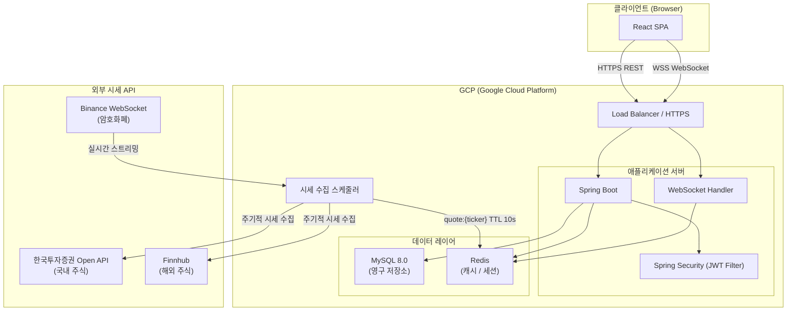
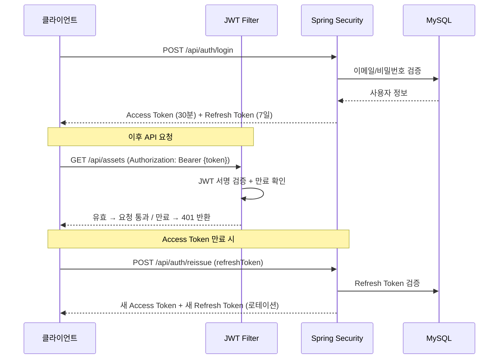
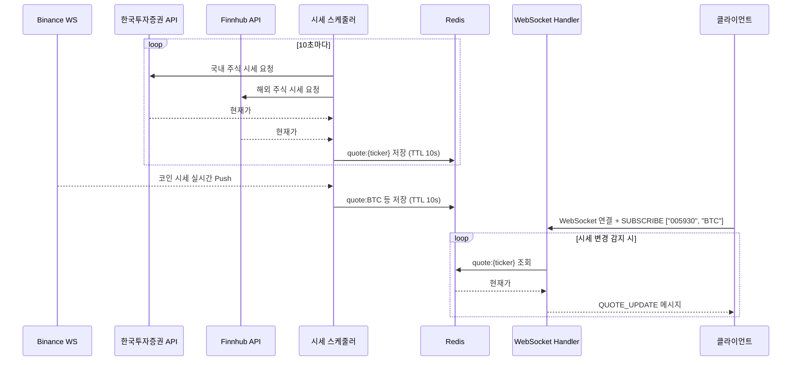
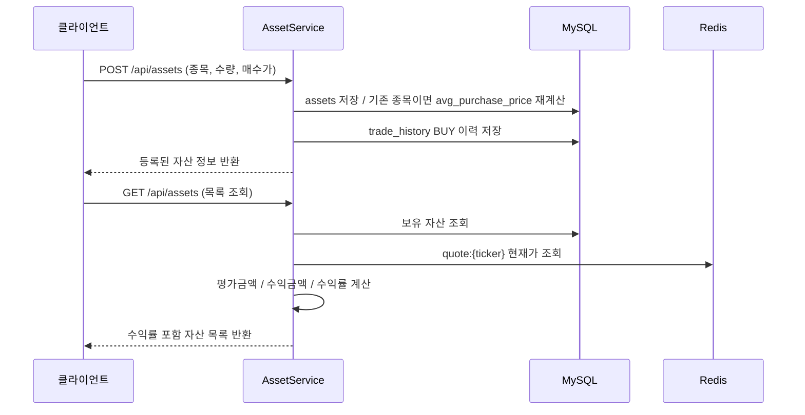

# StockFolio 시스템 아키텍처

**문서 버전:** 1.0  
**작성일:** 2026-04-16  
**프로젝트명:** StockFolio — 실시간 주식/코인 포트폴리오 트래커

---

## 목차

1. [전체 구성도](#1-전체-구성도)
2. [레이어 구조](#2-레이어-구조)
3. [인프라 구성](#3-인프라-구성)
4. [주요 흐름](#4-주요-흐름)
5. [기술 스택 선택 이유](#5-기술-스택-선택-이유)

---

## 1. 전체 구성도



---

## 2. 레이어 구조

### 2.1 백엔드 패키지 구조

```
com.stockfolio
├── auth                    # 인증/인가
│   ├── controller          # /api/auth/**
│   ├── service
│   ├── dto
│   └── filter              # JWT 필터 (Spring Security)
├── user                    # 사용자 관리
│   ├── controller          # /api/users/**
│   ├── service
│   ├── domain              # User 엔티티
│   └── repository
├── asset                   # 자산 관리
│   ├── controller          # /api/assets/**
│   ├── service
│   ├── domain              # Asset, TradeHistory 엔티티
│   └── repository
├── portfolio               # 포트폴리오 집계
│   ├── controller          # /api/portfolio/**
│   ├── service
│   ├── domain              # PortfolioSnapshot 엔티티
│   └── repository
├── chart                   # 차트 데이터
│   ├── controller          # /api/chart/**
│   └── service
├── quote                   # 시세 관련
│   ├── scheduler           # 외부 API 시세 수집
│   ├── service             # Redis 캐시 처리
│   └── websocket           # WebSocket Handler
└── global
    ├── config              # Security, Redis, WebSocket 설정
    ├── exception           # 전역 예외 처리
    └── response            # 공통 응답 구조
```

### 2.2 계층 역할

| 계층 | 역할 |
|------|------|
| Controller | HTTP 요청/응답 처리, DTO 변환 |
| Service | 비즈니스 로직, 트랜잭션 관리 |
| Repository | DB 접근 (Spring Data JPA) |
| Domain | 엔티티 정의 |
| Filter | JWT 토큰 검증 (요청마다 실행) |
| Scheduler | 외부 API 시세 주기적 수집 → Redis 저장 |

### 2.3 프론트엔드 구조

```
src
├── pages
│   ├── LoginPage
│   ├── SignupPage
│   ├── DashboardPage       # 총 자산 현황, 파이 차트
│   ├── PortfolioPage       # 자산 목록, 실시간 수익률
│   ├── ChartPage           # 수익률 추이 차트
│   └── MyPage              # 프로필 관리
├── components              # 재사용 UI 컴포넌트
├── hooks
│   ├── useWebSocket        # 시세 WebSocket 연결/재연결
│   └── useAuth             # JWT 토큰 관리
├── api                     # REST API 호출 (axios)
└── store                   # 전역 상태 (React Context or Zustand)
```

---

## 3. 인프라 구성

### 3.1 GCP 배포 구성

```
인터넷
  │
  ▼
Cloud Load Balancing (HTTPS/WSS 종단)
  │
  ▼
Cloud Run / Compute Engine
  ├── Spring Boot 서버 (포트 8080)
  └── Nginx (리버스 프록시)
  │
  ├── Cloud SQL (MySQL 8.0)
  └── Memorystore (Redis)
```

| 구성 요소 | GCP 서비스 | 역할 |
|-----------|-----------|------|
| 애플리케이션 | Cloud Run 또는 Compute Engine | Spring Boot 실행 |
| 데이터베이스 | Cloud SQL (MySQL 8.0) | 영구 데이터 저장 |
| 캐시 | Memorystore (Redis) | 시세 캐시, Refresh Token |
| 로드밸런서 | Cloud Load Balancing | HTTPS/WSS 처리, 트래픽 분산 |
| 스토리지 | Cloud Storage | 정적 파일 (React 빌드 결과물) |

### 3.2 Redis 키 설계

| Key 패턴 | TTL | 용도 |
|----------|-----|------|
| `quote:{ticker}` | 10s | 종목 시세 캐시 |
| `refresh:{userId}` | 7d | Refresh Token 저장 |

---

## 4. 주요 흐름

### 4.1 JWT 인증 흐름



### 4.2 실시간 시세 흐름



### 4.3 자산 등록 및 수익률 계산 흐름


